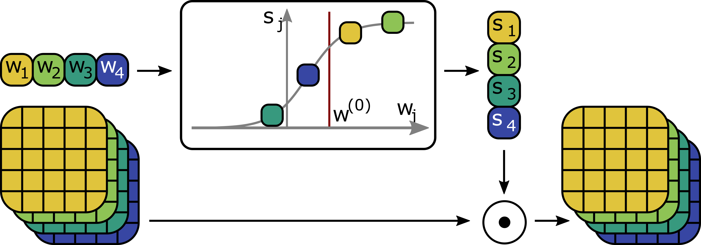
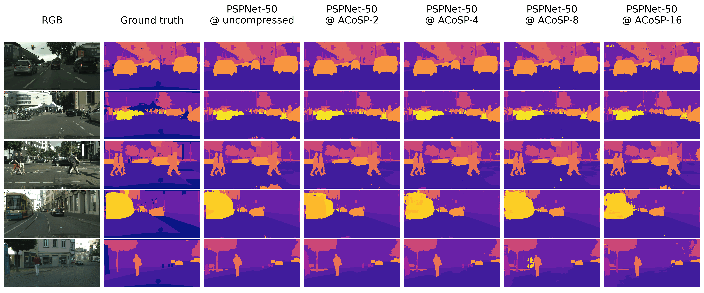

# Pytorch Implementation of Auto-Compressing Subset Pruning for Semantic Image Segmentation

### Introduction

ACoSP is an online pruning algorithm that compresses convolutional neural networks during training.
It learns to select a subset of channels from convolutional layers through a sigmoid function, as shown in the figure.
For each channel a `w_i` is used to scale activations.

<p align="center">
  
</p>

The segmentation maps display compressed PSPNet-50 models trained on Cityscapes. The models are up to 16 times smaller. 



### Repository 

This repository is a PyTorch implementation of ACoSP based on [hszhao/semseg](https://github.com/hszhao/semseg). It was
used to run all experiments used for the publication and is meant to guarantee reproducibility and audibility of our
results.

The training, test and configuration infrastructure is kept close to **semseg**, with only some minor modifications to
enable more reproducibility and integrate our pruning code. The ``model/`` package contains the **PSPNet50** and **SegNet** model definitions. In ``acosp/`` all code required to prune during training is defined.

The current configs expect a special folder structure (but can be easily adapted):

* `/data`: Datasets, Pretrained-weights
* `/logs/exp`: Folder to store experiments

### Installation

1. Clone the repository:

   ```shell
   git clone git@github.com:merantix/acosp.git
   ```

2. Install ACoSP including requirements:

   ```shell
   pip install .
   ```


### Using ACoSP

The implementation of ACoSP is encapsulated in ``/acosp`` and using it independent of all other experimentation code is
quite straight forward.

1. Create a pruner and adapt the model:

```python
from acosp.pruner import SoftTopKPruner
import acosp.inject

# Create pruner object
pruner = SoftTopKPruner(
    starting_epoch=0,
    ending_epoch=100,  # Pruning duration
    final_sparsity=0.5,  # Final sparsity
)
# Add sigmoid soft k masks to model
pruner.configure_model(model)
```

2. In your training loop update the temperature of all masking layers:

```python
# Update the temperature in all masking layers
pruner.update_mask_layers(model, epoch)
```

3. Convert the soft pruning to hard pruning when `ending_epoch` is reached:

```python
if epoch == pruner.ending_epoch:
    # Convert to binary channel mask
    acosp.inject.soft_to_hard_k(model)
```

### Experiments

1. Highlight:

    - All initialization models, trained models are [available](MISSINGLINK).
      The structure is:
      ```
      | init/  # initial models
      | exp/
      |-- ade20k/  # ade20k/camvid/cityscapes/voc2012/cifar10
      | |-- pspnet50_{SPARSITY}/  # the sparsity refers to the relative amount of weights that are removed. I.e. sparsity=0.75 <==> compression_ratio=4 
      |   |-- model # model files
      |   |-- ... # config/train/test files
      |-- evals/  # all result with class wise IoU/Acc
      ```

2. Hardware Requirements: At least 60GB (PSPNet50) / 16GB (SegNet) of GPU RAM. Can be distributed to multiple GPUs.

3. Train:

    - Download related datasets and symlink the paths to them as follows (you can alternatively modify the relevant
      paths specified in folder `config`):

      ```
      mkdir -p /
      ln -s /path_to_ade20k_dataset /data/ade20k
      ```

    - Download ImageNet pre-trained [models]((MISSINGLINK)) and put them under folder `/data` for weight
      initialization. Remember to use the right dataset format detailed in [FAQ.md](./FAQ.md).

    - Specify the gpu used in config then do training.  (Training using acosp have only been carried out on a single
      GPU. And not been tested with DDP). The general structure to access individual configs is as follows:

      ```shell
      sh tool/train.sh ${DATASET} ${CONFIG_NAME_WITHOUT_DATASET}
      ```

      E.g. to train a PSPNet50 on the ade20k dataset and use the config `config/ade20k/ade20k_pspnet50.yaml', execute:

      ```shell
      sh tool/train.sh ade20k pspnet50
      ```


4. Test:

    - Download trained segmentation models and put them under folder specified in config or modify the specified paths.

    - For full testing (get listed performance):

      ```shell
      sh tool/test.sh ade20k pspnet50
      ```


5. Visualization: [tensorboardX](https://github.com/lanpa/tensorboardX) incorporated for better visualization.

   ```shell
   tensorboard --logdir=/logs/exp/ade20k
   ```

6. Other:

    - Resources: GoogleDrive [LINK](MISSINGLINK) contains shared models, visual predictions and data lists.
    - Models: ImageNet pre-trained models and trained segmentation models can be accessed. Note that our ImageNet
      pretrained models are slightly different from
      original [ResNet](https://github.com/pytorch/vision/blob/master/torchvision/models/resnet.py) implementation in
      the beginning part.
    - Predictions: Visual predictions of several models can be accessed.
    - Datasets: attributes (`names` and `colors`) are in folder `dataset` and some sample lists can be accessed.
    - Some FAQs: [FAQ.md](./FAQ.md).

### Performance

Description: **mIoU/mAcc** stands for mean IoU, mean accuracy of each class and all pixel accuracy respectively.
General parameters cross different datasets are listed below:

- Network: `{NETWORK} @ ACoSP-{COMPRESSION_RATIO}`
- Train Parameters: sync_bn(True), scale_min(0.5), scale_max(2.0), rotate_min(-10), rotate_max(10), zoom_factor(8),
  aux_weight(0.4), base_lr(1e-2), power(0.9), momentum(0.9), weight_decay(1e-4).
- Test Parameters: ignore_label(255).

1. **ADE20K**:
   Train Parameters: classes(150), train_h(473), train_w(473), epochs(100). Test Parameters: classes(150), test_h(473),
   test_w(473), base_size(512).

    - Setting: train on **train** (20210 images) set and test on **val** (2000 images) set.

   |  Network            |  mIoU/mAcc  |
   | :-------:           | :---------: |
   | PSPNet50            | 41.42/51.48 |
   | PSPNet50 @ ACoSP-2  | 38.97/49.56 |
   | PSPNet50 @ ACoSP-4  | 33.67/43.17 |
   | PSPNet50 @ ACoSP-8  | 28.04/35.60 |
   | PSPNet50 @ ACoSP-16 | 19.39/25.52 |

2. **PASCAL VOC 2012**:
   Train Parameters: classes(21), train_h(473), train_w(473), epochs(50). Test Parameters: classes(21), test_h(473),
   test_w(473), base_size(512).

    - Setting: train on **train_aug** (10582 images) set and test on **val** (1449 images) set.

   |  Network            |  mIoU/mAcc  |
   | :-------:           | :---------: |
   | PSPNet50            | 77.30/85.27 |
   | PSPNet50 @ ACoSP-2  | 72.71/81.87 |
   | PSPNet50 @ ACoSP-4  | 65.84/77.12 |
   | PSPNet50 @ ACoSP-8  | 58.26/69.65 |
   | PSPNet50 @ ACoSP-16 | 48.06/58.83 |

3. **Cityscapes**:
   Train Parameters: classes(19), train_h(713/512 -PSP/SegNet), train_h(713/1024 -PSP/SegNet), epochs(200). Test
   Parameters: classes(19), train_h(713/512 -PSP/SegNet), train_h(713/1024 -PSP/SegNet), base_size(2048).

    - Setting: train on **fine_train** (2975 images) set and test on **fine_val** (500 images) set.

   |  Network            |  mIoU/mAcc  |
   | :-------:           | :---------: |
   | PSPNet50            | 77.35/84.27 |
   | PSPNet50 @ ACoSP-2  | 74.11/81.73 |
   | PSPNet50 @ ACoSP-4  | 71.50/79.40 |
   | PSPNet50 @ ACoSP-8  | 66.06/74.33 |
   | PSPNet50 @ ACoSP-16 | 59.49/67.74 |
   | SegNet              | 65.12/73.85 |
   | SegNet @ ACoSP-2    | 64.62/73.19 |
   | SegNet @ ACoSP-4    | 60.77/69.57 |
   | SegNet @ ACoSP-8    | 54.34/62.48 |
   | SegNet @ ACoSP-16   | 44.12/50.87 |

3. **CamVid**:
   Train Parameters: classes(11), train_h(360), train_w(720), epochs(450). Test Parameters: classes(11), test_h(360),
   test_w(720), base_size(360).

    - Setting: train on **train** (367 images) set and test on **test** (233 images) set.

   |  Network          |  mIoU/mAcc  |
   | :-------:         | :---------: |
   | SegNet            | 55.49+-0.85/65.44+-1.01 |
   | SegNet @ ACoSP-2  | 51.85+-0.83/61.86+-0.85 |
   | SegNet @ ACoSP-4  | 50.10+-1.11/59.79+-1.49 |
   | SegNet @ ACoSP-8  | 47.25+-1.18/56.87+-1.10 |
   | SegNet @ ACoSP-16 | 42.27+-1.95/51.25+-2.02 |


3. **Cifar10**:
   Train Parameters: classes(10), train_h(32), train_w(32), epochs(50). Test Parameters: classes(10), test_h(32),
   test_w(32), base_size(32).

    - Setting: train on **train** (50000 images) set and test on **test** (10000 images) set.

   |  Network            |  mAcc  |
   | :-------:           | :----: |
   | ResNet18            | 89.68  |
   | ResNet18 @ ACoSP-2  | 88.50  |
   | ResNet18 @ ACoSP-4  | 86.21  |
   | ResNet18 @ ACoSP-8  | 81.06  |
   | ResNet18 @ ACoSP-16 | 76.81  |


### Citation

If you find the `acosp/` code or trained models useful, please consider citing:


For the general training code, please also consider referencing [hszhao/semseg](https://github.com/hszhao/semseg).

### Question

Some [FAQ.md](./FAQ.md) collected. You are welcome to send pull requests or give some advices. Contact
information: ` at `.
