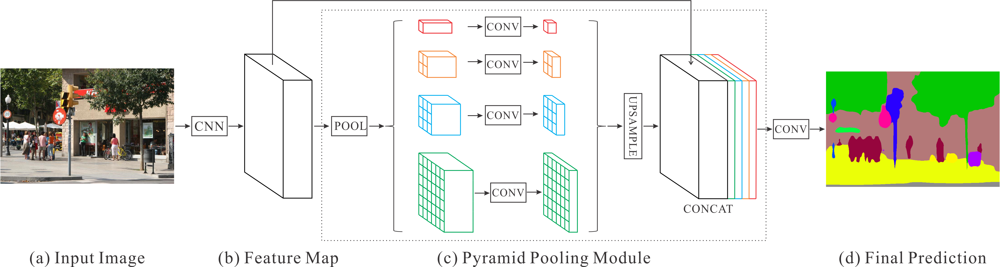

# PyTorch Semantic Segmentation

### Introduction

This repository is a PyTorch implementation for semantic segmentation / scene parsing. The code is easy to use for training and testing on various datasets. The codebase mainly uses ResNet50/101/152 as backbone and can be easily adapted to other basic classification structures. Implemented networks including [PSPNet](https://hszhao.github.io/projects/pspnet) and [PSANet](https://hszhao.github.io/projects/psanet), which ranked 1st places in [ImageNet Scene Parsing Challenge 2016 @ECCV16](http://image-net.org/challenges/LSVRC/2016/results), [LSUN Semantic Segmentation Challenge 2017 @CVPR17](https://blog.mapillary.com/product/2017/06/13/lsun-challenge.html) and [WAD Drivable Area Segmentation Challenge 2018 @CVPR18](https://bdd-data.berkeley.edu/wad-2018.html). Sample experimented datasets are [ADE20K](http://sceneparsing.csail.mit.edu), [PASCAL VOC 2012](http://host.robots.ox.ac.uk:8080/leaderboard/displaylb.php?challengeid=11&compid=6) and [Cityscapes](https://www.cityscapes-dataset.com).



### Update

- 2020.05.15: Branch `master`, use official [nn.SyncBatchNorm](https://pytorch.org/docs/master/nn.html#torch.nn.SyncBatchNorm), only multiprocessing training is supported, tested with pytorch 1.4.0.
- 2019.05.29: Branch `1.0.0`, both multithreading training ([nn.DataParallel](https://pytorch.org/docs/stable/nn.html#dataparallel)) and multiprocessing training ([nn.parallel.DistributedDataParallel](https://pytorch.org/docs/stable/_modules/torch/nn/parallel/distributed.html)) (**recommended**) are supported. And the later one is much faster. Use `syncbn` from [EncNet](https://github.com/zhanghang1989/PyTorch-Encoding) and [apex](https://github.com/NVIDIA/apex), tested with pytorch 1.0.0.

### Usage

1. Highlight:

   - Fast multiprocessing training ([nn.parallel.DistributedDataParallel](https://pytorch.org/docs/stable/_modules/torch/nn/parallel/distributed.html)) with official [nn.SyncBatchNorm](https://pytorch.org/docs/master/nn.html#torch.nn.SyncBatchNorm).
   - Better reimplementation results with well designed code structures.
   - All initialization models, trained models and predictions are [available](https://drive.google.com/open?id=15wx9vOM0euyizq-M1uINgN0_wjVRf9J3).

2. Requirement:

   - Hardware: 4-8 GPUs (better with >=11G GPU memory)
   - Software: PyTorch>=1.1.0, Python3, [tensorboardX](https://github.com/lanpa/tensorboardX), 

3. Clone the repository:

   ```shell
   git clone https://github.com/hszhao/semseg.git
   ```

4. Train:

   - Download related datasets and symlink the paths to them as follows (you can alternatively modify the relevant paths specified in folder `config`):

     ```
     cd semseg
     mkdir -p dataset
     ln -s /path_to_ade20k_dataset dataset/ade20k
     ```

   - Download ImageNet pre-trained [models]((https://drive.google.com/open?id=15wx9vOM0euyizq-M1uINgN0_wjVRf9J3)) and put them under folder `initmodel` for weight initialization. Remember to use the right dataset format detailed in [FAQ.md](./FAQ.md).

   - Specify the gpu used in config then do training:

     ```shell
     sh tool/train.sh ade20k pspnet50
     ```
   - If you are using [SLURM](https://slurm.schedmd.com/documentation.html) for nodes manager, uncomment lines in train.sh and then do training:

     ```shell
     sbatch tool/train.sh ade20k pspnet50
     ```

5. Test:

   - Download trained segmentation models and put them under folder specified in config or modify the specified paths.

   - For full testing (get listed performance):

     ```shell
     sh tool/test.sh ade20k pspnet50
     ```

   - **Quick demo** on one image:

     ```shell
     PYTHONPATH=./ python tool/demo.py --config=config/ade20k/ade20k_pspnet50.yaml --image=figure/demo/ADE_val_00001515.jpg TEST.scales '[1.0]'
     ```

6. Visualization: [tensorboardX](https://github.com/lanpa/tensorboardX) incorporated for better visualization.

   ```shell
   tensorboard --logdir=exp/ade20k
   ```

7. Other:

   - Resources: GoogleDrive [LINK](https://drive.google.com/open?id=15wx9vOM0euyizq-M1uINgN0_wjVRf9J3) contains shared models, visual predictions and data lists.
   - Models: ImageNet pre-trained models and trained segmentation models can be accessed. Note that our ImageNet pretrained models are slightly different from original [ResNet](https://github.com/pytorch/vision/blob/master/torchvision/models/resnet.py) implementation in the beginning part.
   - Predictions: Visual predictions of several models can be accessed.
   - Datasets: attributes (`names` and `colors`) are in folder `dataset` and some sample lists can be accessed.
   - Some FAQs: [FAQ.md](./FAQ.md).
   - Former video predictions: high accuracy -- [PSPNet](https://youtu.be/rB1BmBOkKTw), [PSANet](https://youtu.be/l5xu1DI6pDk); high efficiency -- [ICNet](https://youtu.be/qWl9idsCuLQ).

### Performance

Description: **mIoU/mAcc/aAcc** stands for mean IoU, mean accuracy of each class and all pixel accuracy respectively. **ss** denotes single scale testing and **ms** indicates multi-scale testing. Training time is measured on a sever with 8 GeForce RTX 2080 Ti. General parameters cross different datasets are listed below:

- Train Parameters: sync_bn(True), scale_min(0.5), scale_max(2.0), rotate_min(-10), rotate_max(10), zoom_factor(8), ignore_label(255), aux_weight(0.4), batch_size(16), base_lr(1e-2), power(0.9), momentum(0.9), weight_decay(1e-4).
- Test Parameters: ignore_label(255), scales(single: [1.0], multiple: [0.5 0.75 1.0 1.25 1.5 1.75]).

1. **ADE20K**:
   Train Parameters: classes(150), train_h(473/465-PSP/A), train_w(473/465-PSP/A), epochs(100).
   Test Parameters: classes(150), test_h(473/465-PSP/A), test_w(473/465-PSP/A), base_size(512).

   - Setting: train on **train** (20210 images) set and test on **val** (2000 images) set.

   |  Network  |  mIoU/mAcc/aAcc(ss)   |  mIoU/mAcc/pAcc(ms)   | Training Time |
   | :-------: | :-------------------: | :-------------------: | :-----------: |
   | PSPNet50  | 0.4189/0.5227/0.8039. | 0.4284/0.5266/0.8106. |      14h      |
   | PSANet50  | 0.4229/0.5307/0.8032. | 0.4305/0.5312/0.8101. |      14h      |
   | PSPNet101 | 0.4310/0.5375/0.8107. | 0.4415/0.5426/0.8172. |      20h      |
   | PSANet101 | 0.4337/0.5385/0.8102. | 0.4414/0.5392/0.8170. |      20h      |

2. **PSACAL VOC 2012**:
   Train Parameters: classes(21), train_h(473/465-PSP/A), train_w(473/465-PSP/A), epochs(50).
   Test Parameters: classes(21), test_h(473/465-PSP/A), test_w(473/465-PSP/A), base_size(512).

   - Setting: train on **train_aug** (10582 images) set and test on **val** (1449 images) set.

   |  Network  |  mIoU/mAcc/aAcc(ss)   |  mIoU/mAcc/pAcc(ms)   | Training Time |
   | :-------: | :-------------------: | :-------------------: | :-----------: |
   | PSPNet50  | 0.7705/0.8513/0.9489. | 0.7802/0.8580/0.9513. |     3.3h      |
   | PSANet50  | 0.7725/0.8569/0.9491. | 0.7787/0.8606/0.9508. |     3.3h      |
   | PSPNet101 | 0.7907/0.8636/0.9534. | 0.7963/0.8677/0.9550. |      5h       |
   | PSANet101 | 0.7870/0.8642/0.9528. | 0.7966/0.8696/0.9549. |      5h       |

3. **Cityscapes**:
   Train Parameters: classes(19), train_h(713/709-PSP/A), train_w(713/709-PSP/A), epochs(200).
   Test Parameters: classes(19), test_h(713/709-PSP/A), test_w(713/709-PSP/A), base_size(2048).

   - Setting: train on **fine_train** (2975 images) set and test on **fine_val** (500 images) set.

   |  Network  |  mIoU/mAcc/aAcc(ss)   |  mIoU/mAcc/pAcc(ms)   | Training Time |
   | :-------: | :-------------------: | :-------------------: | :-----------: |
   | PSPNet50  | 0.7730/0.8431/0.9597. | 0.7838/0.8486/0.9617. |      7h       |
   | PSANet50  | 0.7745/0.8461/0.9600. | 0.7818/0.8487/0.9622. |     7.5h      |
   | PSPNet101 | 0.7863/0.8577/0.9614. | 0.7929/0.8591/0.9638. |      10h      |
   | PSANet101 | 0.7842/0.8599/0.9621. | 0.7940/0.8631/0.9644. |     10.5h     |

### Citation

If you find the code or trained models useful, please consider citing:

```
@misc{semseg2019,
  author={Zhao, Hengshuang},
  title={semseg},
  howpublished={\url{https://github.com/hszhao/semseg}},
  year={2019}
}
@inproceedings{zhao2017pspnet,
  title={Pyramid Scene Parsing Network},
  author={Zhao, Hengshuang and Shi, Jianping and Qi, Xiaojuan and Wang, Xiaogang and Jia, Jiaya},
  booktitle={CVPR},
  year={2017}
}
@inproceedings{zhao2018psanet,
  title={{PSANet}: Point-wise Spatial Attention Network for Scene Parsing},
  author={Zhao, Hengshuang and Zhang, Yi and Liu, Shu and Shi, Jianping and Loy, Chen Change and Lin, Dahua and Jia, Jiaya},
  booktitle={ECCV},
  year={2018}
}
```

### Question

Some [FAQ.md](./FAQ.md) collected. You are welcome to send pull requests or give some advices. Contact information: `hengshuangzhao at gmail.com`.
